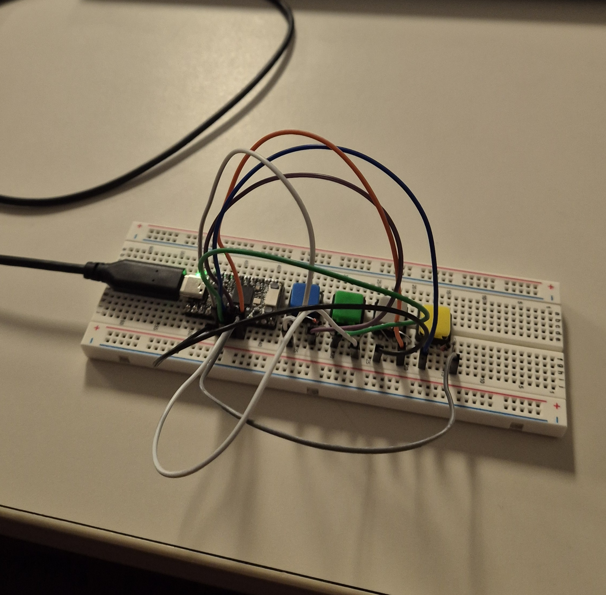
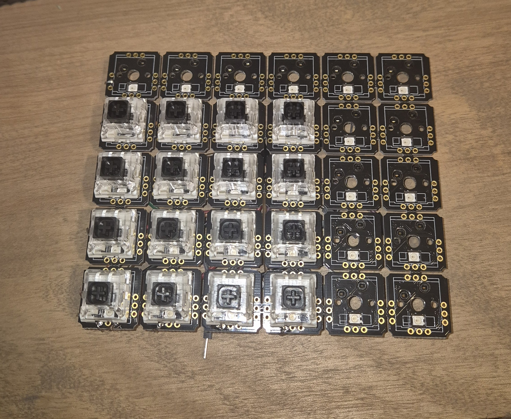
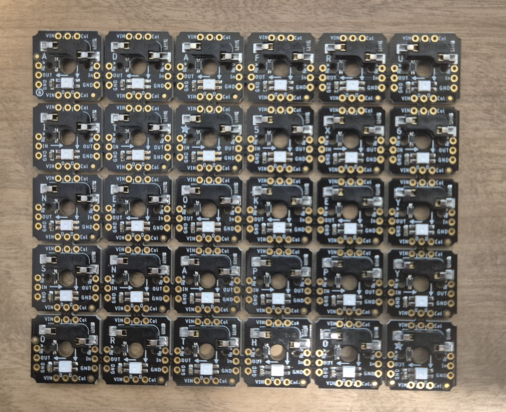
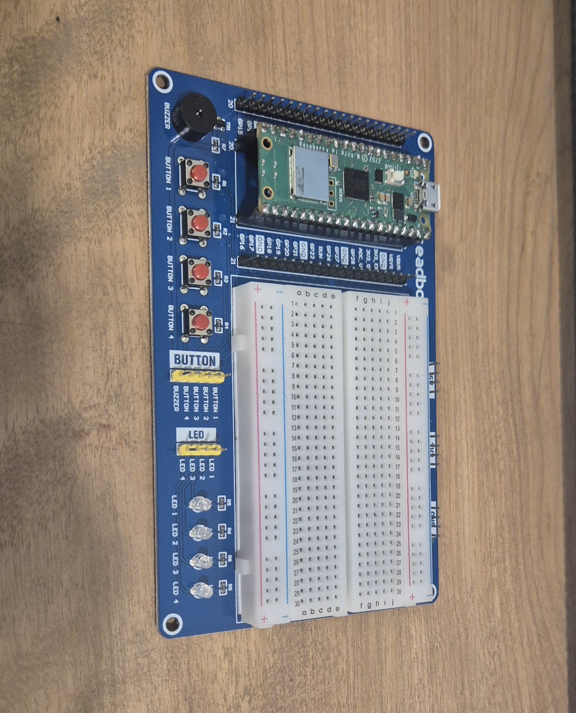
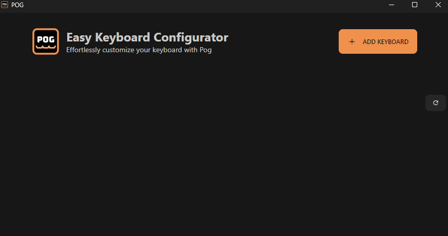
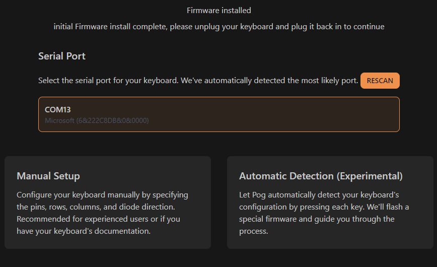
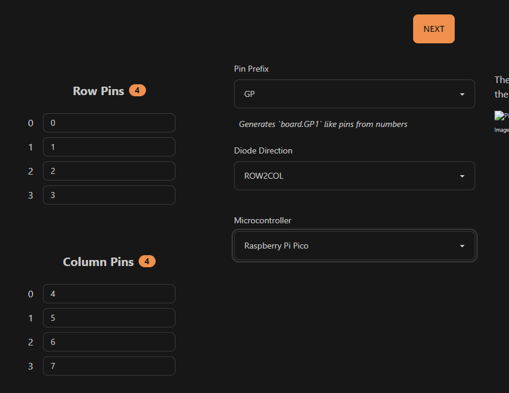
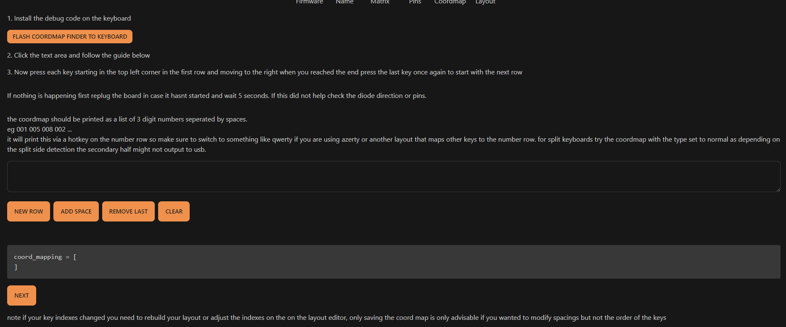
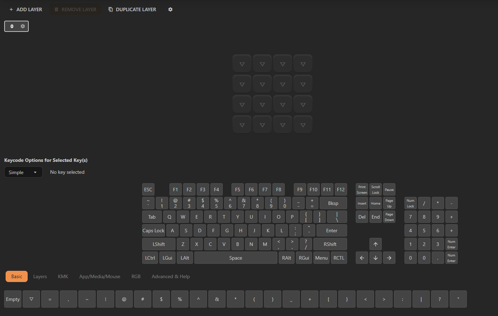
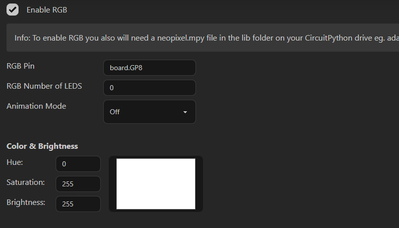

# Tutoriel KeyCube Keyboard

## Mise en place d’un clavier 2x2

### Hardware

#### Matériel nécessaire :
- Table de prototypage  
- Micro-Contrôleur (Raspberry Pi Pico dans mon cas)  
- Switchs  
- Diodes  
- Câbles  

#### Instructions
1. Apprendre le fonctionnement des micro-contrôleurs et des pins.
   - Référence : [Datasheet Raspberry Pi Pico](https://datasheets.raspberrypi.com/pico/pico-2-datasheet.pdf)
2. Souder les broches au Raspberry Pi Pico pour la connexion sur la table de prototypage.

### Branchements


1. Brancher le Raspberry Pi Pico sur la table de prototypage.
2. Brancher les 4 switchs avec quelques centimètres d’espace entre eux.
3. Ajouter les diodes :
   - Côté non-noir de la diode sur le 2e pin du switch.
   - Autre côté sur une colonne vide de la table de prototypage.
4. Répéter l’opération pour chaque switch.
5. Brancher les câbles :
   - 1er pin du 1er switch → GP1
   - 1er pin du 2e switch → GP3
   - 1er pin du 3e switch → GP1
   - 1er pin du 4e switch → GP2
6. Connecter les diodes aux colonnes libres :
   - Diode du 1er switch → GP3
   - Diode du 2e switch → GP4
   - Diode du 3e switch → GP3
   - Diode du 4e switch → GP4

---

## Software

### Installation de CircuitPython


1. Connecter le Raspberry Pi Pico à l’ordinateur.
2. Télécharger CircuitPython : [CircuitPython Raspberry Pi Pico](https://circuitpython.org/board/raspberry_pi_pico/)
3. Glisser le fichier téléchargé dans le périphérique `RPI-RP2`.
4. Le périphérique sera renommé `CIRCUITPY` une fois l’installation terminée.

#### Ressources :
- [Documentation CircuitPython](https://learn.adafruit.com/welcome-to-circuitpython/what-is-circuitpython)

### Utilisation de CircuitPython

1. Installer un éditeur de code compatible, par exemple [MuEditor](https://codewith.mu)
2. Installer `KmKFirmware` : [GitHub KMK Firmware](https://github.com/KMKfw/kmk_firmware)
3. Télécharger et extraire le dossier `kmk` dans `CIRCUITPY`
4. Créer un fichier `code.py` et insérer le code suivant :

```python
#Ce code est la uniquement à titre d'exemple simple pour un raspberry pico. Vous pouvez effectuer des modifications sur ce code.
import time 
import board 
import os 
from kmk.kmk_keyboard import KMKKeyboard 
from kmk.keys import KC 
from kmk.scanners import DiodeOrientation 

# Initialisation du clavier KMK 
keyboard = KMKKeyboard() 
keyboard.col_pins = (board.GP2, board.GP3)  # Colonnes
keyboard.row_pins = (board.GP4, board.GP5)  # Rangées
keyboard.diode_orientation = DiodeOrientation.COL2ROW  # Orientation des diodes

# Mappage des touches 
keyboard.keymap = [
    [KC.A, KC.B, KC.C, KC.D],  # Rangée 1
]

if __name__ == '__main__': 
    keyboard.go()
```

---

## Mise en place d’un clavier 4x4


### Hardware

#### Matériel nécessaire :
- Matrice (ex: Adafruit NeoKey 6x6)  
- Switchs  
- Câbles  
- Atelier de soudure  
- Breadboard  

### Soudures


1. Couper 6 câbles en deux et les dénuder.
2. Souder les câbles en suivant l’ordre des flèches de la matrice.
3. Souder les pins utiles :
   - `In` pour les LEDs (Uniquement sur 0x0)
   - `Row` et `Col` sur les bords de la matrice
   - `Vin` & `GND` pour l’alimentation (Uniquement sur 0x0)

### Branchements


1. Connecter la breadboard et le microcontrôleur.
2. Brancher `row0` sur GP0, `row1` sur GP1, etc. Pour les cols, reprenez ensuite du PIN sur lequel vous vous êtes arrêtés.
3. Connecter les colonnes aux GP correspondants.
4. Ajouter le `GND` sur le `GND` du Pico.
5. Brancher `In` sur un pin GP libre et `VIN` sur `VBUS` du Pico.
##### Le VBUS sert uniquement au RGB tout comme le IN

---

## Software

### Option :
- Suivre la vidéo youtube à ce lien : [[FR] Configuration de Pog Keyboard](https://youtu.be/-tIEQIu1wgI)

### Prérequis
- Passer le clavier de l’ordinateur en **QWERTY**.
- Installer `pog` : [GitHub Pog](https://github.com/JanLunge/pog/releases)

### Configuration du clavier


1. Brancher le Pico à l’ordinateur.
2. Ouvrir `pog` et sélectionner `Add Keyboard` → `New Keyboard`.

3. Choisir le port USB du Pico et cliquer sur `Manual Setup`.

4. Installer `KMK` si nécessaire, puis entrer les configurations.

5. Définir le clavier en `4x4`.
6. Renseigner les pins selon les branchements effectués.

7. Sélectionner `Row2Col` pour les diodes.
##### En effet on inverse le sens "normal" des diodes car le logiciel a un petit problème à ce niveau
8. Cliquer sur `Flash coordmap finder to keyboard`.
9. Tester chaque touche dans le bon ordre.
10. Ajouter les retours à la ligne pour une bonne configuration.


### Modification de la disposition des touches
1. Aller dans l’onglet `Keymap` de `pog`.
2. Sélectionner chaque touche et attribuer la valeur souhaitée.


### LED et rétroéclairage


1. Télécharger `Neopixel 9.X` : [GitHub NeoPixel](https://github.com/adafruit/Adafruit_CircuitPython_NeoPixel/releases)
2. Créer un dossier `lib` sur le Pico.
3. Déplacer le fichier `neopixel.mpy` dans `lib`.
4. Aller dans l’onglet `RGB` de `pog`.
5. Activer `Enable RGB` et renseigner le pin `In` du Pico.
6. Configurer l’éclairage RGB selon vos préférences.

---

## Liaison de 2 matrices et plus

### Prérequis
1. Avoir deux matrices prêtes et soudées
2. Raspberry Pico
3. Breadboard (optionnel)
